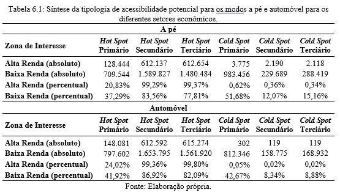

```{r child = "setup.Rmd"}
```

```{r xaringan-tile-view, echo=FALSE}
xaringanExtra::use_tile_view()
```

```{r xaringan-editable, echo=FALSE}
xaringanExtra::use_editable(expires = 1)
```

```{r xaringan-panelset, echo=FALSE, message=FALSE, warning=FALSE}
xaringanExtra::use_panelset()
xaringanExtra::style_panelset_tabs(panel_tab_font_family = "sans-serif")
```

```{r xaringanExtra-clipboard, echo=FALSE}
htmltools::tagList(
  xaringanExtra::use_clipboard(
    button_text = "<i class=\"fa fa-clipboard\"></i>",
    success_text = "<i class=\"fa fa-check\" style=\"color: #90BE6D\"></i>",
    error_text = "<i class=\"fa fa-times-circle\" style=\"color: #F94144\"></i>"
  ),
  rmarkdown::html_dependency_font_awesome()
)
```

```{r xaringan-fit-screen, echo=FALSE}
xaringanExtra::use_fit_screen()
```

```{r xaringan-extra-styles, echo=FALSE}
xaringanExtra::use_extra_styles(
  hover_code_line = TRUE,         #<<
  mute_unhighlighted_code = TRUE  #<<
)
```

```{r broadcast, echo=FALSE}
xaringanExtra::use_broadcast()
```

```{r xaringan-scribble, echo=FALSE}
xaringanExtra::use_scribble()
```


# Engenharia de transportes

.large[
- Foco em solução
- Resultado financeiro corporativo
]

---

# Epistemologia em Geografia

.large[
- Urbana, econômica e MUITO quantitativa
- Crítica e humanista-comportamental
]

---

# Categorias de análise da geografia

.large[
- espaço
- região
- paisagem
- **lugar**
- **território**
]

---

# Acessibilidade, qualidade de vida e justiça social

.large[
- desigualdades socioespaciais
- impactos de políticas públicas
]

---

```{r, echo=FALSE, out.width="90%"}

```  


---

```{r, echo=FALSE, out.width="90%"}

```  


---

```{r, echo=FALSE, out.width="80%"}

```  

---

```{r, echo=FALSE, out.width="90%"}

```  

---

```{r, echo=FALSE, out.width="50%"}

```  

---

```{r, echo=FALSE, out.width="50%"}

```  

---

```{r, echo=FALSE, out.width="50%"}

```  

---

```{r, echo=FALSE, out.width="50%"}

```  

---

```{r, echo=FALSE, out.width="60%"}

```  

---

```{r, echo=FALSE, out.width="40%"}

```  

---

```{r, echo=FALSE, out.width="40%"}

```  

---

```{r, echo=FALSE, out.width="40%"}

```  

---

```{r, echo=FALSE, out.width="90%"}

```  

---

# Caracterização + Diagnóstico + Avaliação

.large[
- Foco no problema
]

---

# Pandemia, Gig Economy, 4a e 5a rev industrial

.large[
- Periferização x favelização
- Velocidade x distância
- Acesso x mobilidade
- Cidades inteligentes x cidades em escala humana
- _Unpredictability_
- Trabalho informal
]

---
# Para me conhecer melhor!

https://bookdown.org/renataoliveira/memorial/man2.html
